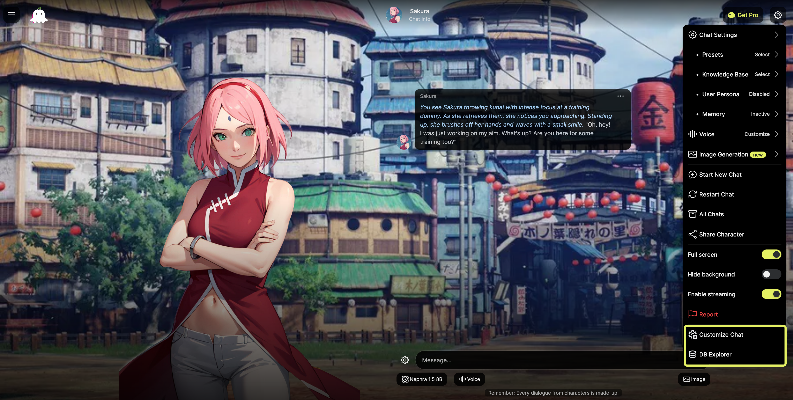
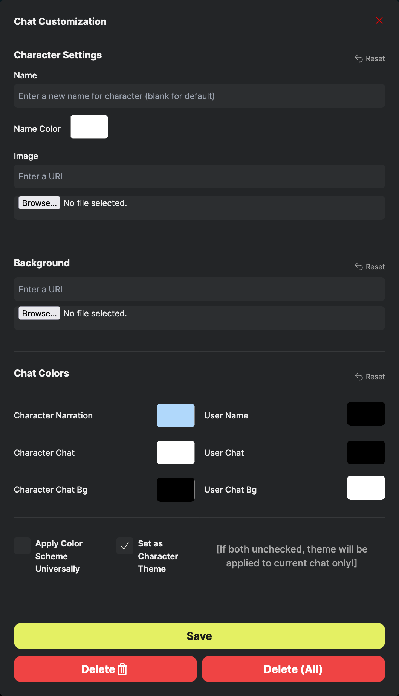
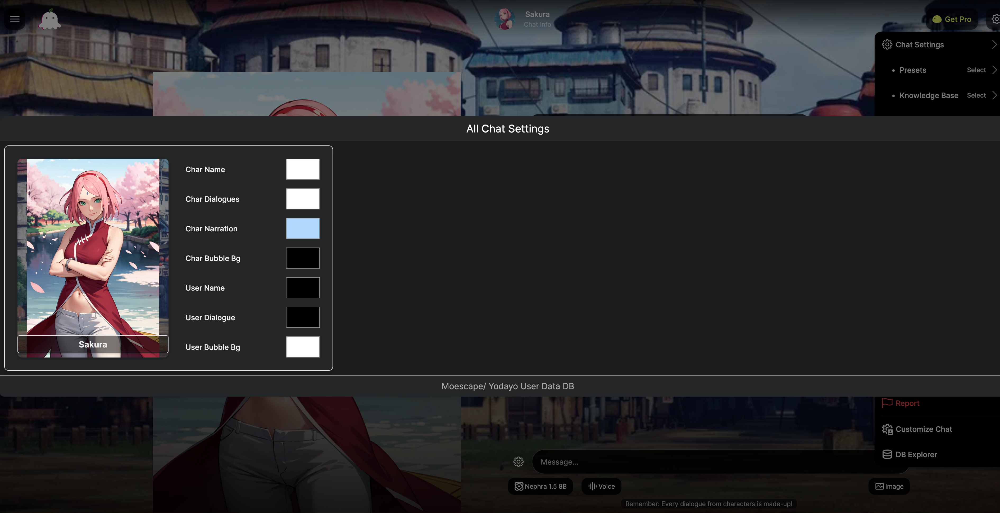

# Yodayo/Moescape-Chat-Customizer

Customize Moescape/Yodayo Tavern chat to your liking.

## Overview
Yodayo Chat Customizer is a userscript that allows you to fully customize the appearance and behavior of the Yodayo chat interface. This project is a work in progress and open to contributions.

## Features
- Change chat colors, backgrounds, and themes per character or globally
- Save, delete, and manage chat/character themes
- Image viewer for all stored characters
- Easy-to-use UI integrated into the chat
- Settings persist via local database
- Lightweight and easy to install

## Installation

**Requirements:**
- A userscript manager such as [Tampermonkey](https://www.tampermonkey.net/) or [Violentmonkey](https://violentmonkey.github.io/)

**To install:**
1. Make sure you have a userscript manager extension installed in your browser.
2. Copy and paste the following URL into your browser's address bar:

   ```
   https://github.com/pervertir/Yodayo-Chat-Customizer/raw/refs/heads/main/MoescapeCustomUI.user.js
   ```

3. Your userscript extension will detect the script and prompt you to install it.

## Usage

### Chat Customizer
1. Once installed, use the settings cog (in the top right corner) in your chat to access the added features.

   

2. When you click "Customize Chat", you will see the following modal:

   

3. Some features may break as the site updates. Please report issues if you encounter them.
4. You must click **Save** to store your changes in the database. If you don't press save, your changes will not persist the next time you open the chat.
5. **Delete** will remove the Chat ID from the database (removing the settings you saved for the current chat only).
6. **Delete All** will remove the character from the database, which will remove the saved theme for all chats of that character.
7. If you want to change the theme for all chats (not just a specific character), check **Apply Color Scheme Universally**. This will only store the colors, so you can still upload different images per character/chat.
8. **Unchecking** "Set as Character Theme" before saving will save the theme for the current chat only.

### Image Viewer
This feature allows you to see all characters stored in your database.



## FAQ

**Q: Will this break if Yodayo updates?**  
A: Some features may break if the site changes. Please open an issue if you notice anything not working.

**Q: Where are my settings stored?**  
A: All settings are stored locally in your browser's database. Clearing your browser data will remove your customizations.

**Q: Can I use this on other browsers?**  
A: Yes, as long as your browser supports userscript managers like Tampermonkey or Violentmonkey.

## Contributing
Contributions are welcome! Please open an issue or submit a pull request if you have suggestions or improvements.

## License
This project is licensed under the MIT License. See the [LICENSE](LICENSE) file for details.
